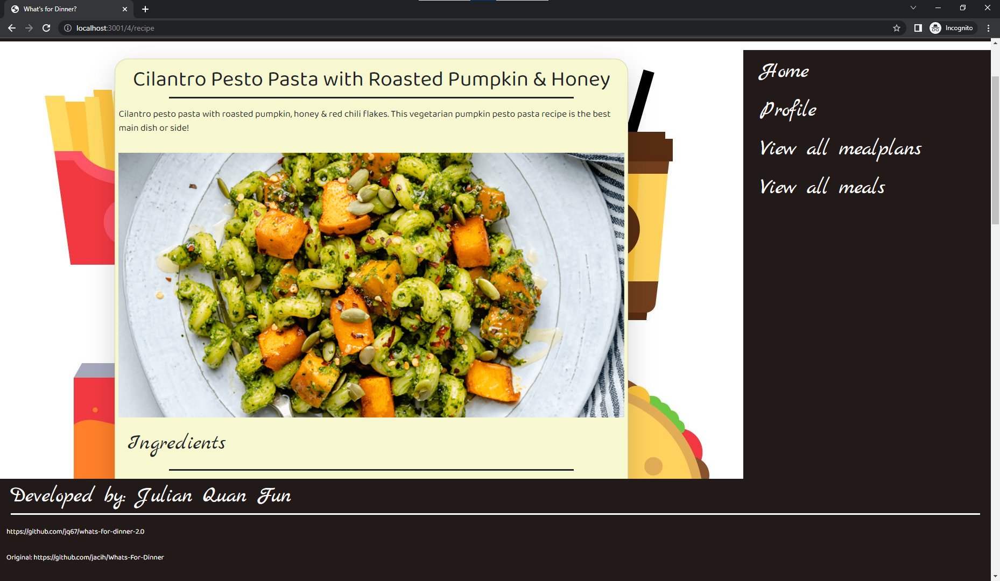

# What's for Dinner? 

## Description

https://wfd-react.herokuapp.com/

### What does What's for Dinner? do?

This project allows users to create and share mealplans from a database of meals. This project also uses a npm recipe scraper package to allow users to view recipes for each meal that is part of the database.

This is a remake of another project using MongoDB, Graphql, and React.


## Table of Contents

- [Installation](#installation)
- [Usage](#usage)
- [Credits](#credits)
- [Contribution](#contribution)
- [Questions](#questions)
- [Licence](#licence)

---

## Installation 

### Technologies Used in Development

Technologies used include:

This project is a fullstack project that uses MongoDB, Graphql and React, aswell as a recipe scraper package.

### Installation Instructions

```md
visit deployment on heroku!
https://wfd-react.herokuapp.com/
```

## Usage



```md
First the user should create an account. Then the user can view mealplans to add to their account, create new mealplans, or view recipes for the various meals on the database.
```

## Credits

The original unfinished project was started by github users jacih, Jeungs and myself.

## Contribution

Guidelines for contribution:

Next steps for development are tags for meals and plans to be able to search efficiently, a way for users to submit new meals/recipes, and a calendar that would be able to be used to keep track of upcoming meals.

## Questions

No contact please

https://github.com/jq67


---
## Licence
This project is covered under the `Mit License`